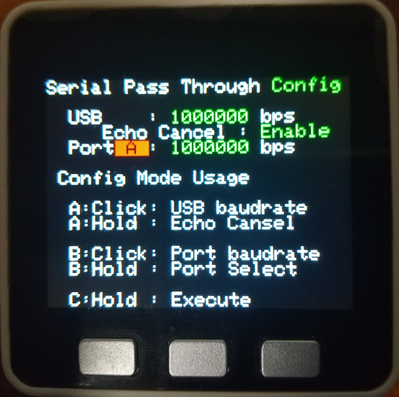

# Serial Pass Through

## 概要  
- M5StackをPCに接続した際のUSBシリアルをM5StackのPortA,B,Cのいずれかにパススルーします  
- シリアル接続のサーボをインタフェースボード等を介してM5Stackにシリアル接続している場合にそのままでPC上で動くサーボのユーティリティ等で見ることができます  
  例えば ｽﾀｯｸﾁｬﾝ SCサーボモデルに使われるサーボ(FEETECH SCS0009)の
  設定には通常インターフェースボードFE-URT-1を利用しますがｽﾀｯｸﾁｬﾝの基板にはSCサーボと通信できる信号変換機能がある為
  ｽﾀｯｸﾁｬﾝ(M5Stack)のUSBシリアルからそちらへパススルーすることによりFE-URT-1がなくてもサーボの設定が行えます

## 環境
  VSCode + PlatformIO  
   または Arduino IDE (src/main.cpp を SerialPassthrogh.ino 等にリネームして利用してください)

## 使用ライブラリと動作確認バージョン
- M5Unified 0.1.14
- gob_unifiedButton 0.1.4 (CoreS3のみ)

## 対応機種
下記のいずれかで利用できます
- M5Stack (BASIC/GRAY/M5GO/FIRE)  
  env:M5Stack
- M5Stack CORE2 (CORE2 for AWS を含む)  
  env:M5Stack_Core2
- M5Stack CoreS3  
  env:M5Stack_CoreS3

## 制限事項
- M5Stack(BASIC/GRAY/M5GO/FIRE) のPortAは内部I2Cと共用の為ハイインピーダンス状態に依存する回路(Stack-chan TakaoBase SCS0009等のダイオードを利用した簡易回路)では利用できません
- 通信スピードは可能であればUSB側とPort側は同じにしてください  
(異なると通信バッファがオーバーフローする可能性があります)
- 設定上 4500000bpsまで用意していますが検証をしていないため正常に動作しないかもしれません

## 利用方法
- 起動すると Config モードとなります
- Aボタンを押すとUSB側の通信スピードが変更できます
- Aボタンを長押しするとエコーキャンセルの有効/無効が切替れます  
※一部のサーボ接続インタフェースでデータ送信時にループバックして送信データを受信してしまう場合に有効にすると受信しなくなります
- Bボタンを押すとPort側の通信スピードが変更できます  
- Bボタンを長押しすると利用するPortをPortA,PortB,PortCの3つのうちどれかに切り替えができます
- Cボタンを長押しするとExecモードとなりパススルー動作の実行を開始します  
 Execモードでは操作は受け付けません※ので再度設定を変更したい場合は電源を入れなおすかリセットしてください  
※ボタンの検出等を入れると通信が遅延するため

※なおボタンのないCORE2はボタンエリアを、CoreS3は画面の左の方、中央、右の方をタップと読み替えてください

## 補足
ｽﾀｯｸﾁｬﾝ基板(v0.2.1)を利用したシリアルサーボのツール利用方法　  
- 本プログラムを書き込んだM5Stackコアをｽﾀｯｸﾁｬﾝ基板に取り付ける
- スピードはどちらも1000000bps、エコーキャンセル有効、PortC に設定して実行する
- FT-SCServoDebugツールを立ち上げて  
  - Com Settings で M5Stackコアの繋がっているComポートを選択
  - BaudRは1000000にして「Open」ボタンを押す (ここでM5Stackコアの画面が消えることがあります、その場合は一度リセットして再度行ってみてください)
  - ServoListの「Search」ボタンを押すとｽﾀｯｸﾁｬﾝ基板に接続された
    SCサーボが2つ見つかるので「Stop」ボタンを押してサーチを停止します  

あとはFE-URT-1を利用する場合と操作は同じです  
※サーボが検出されない場合は一度M5Stackコアをリセットして再度やってみてください  
 ※購入したまま(ID:1)のサーボが2つ接続されている場合は検出できませんので ID:1 のままで良いパン(左右＝足)のサーボのコネクタを一時的に取り外してチルト(上下)のサーボのIDを 2 に変更してください

## ライセンス
[MIT](LICENSE)

## Author
[washishi](https://github.com/washishi)